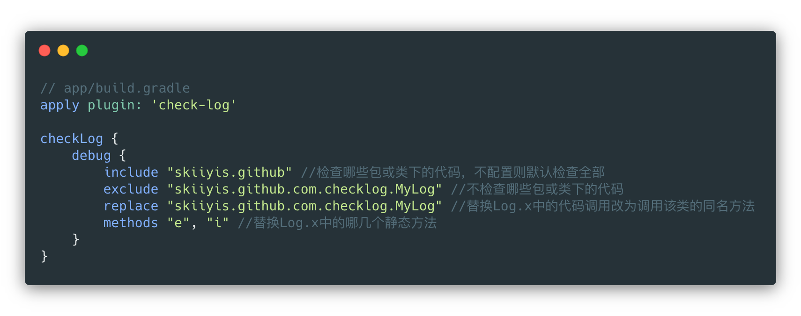

# CheckLog  

自动查找代码中的android.util.Log，并将其中的方法调用替换成你想要调用的类
  
    

## 使用方式  

由于github中的代码没有上传到mavenCenter, 可能会导致首次sync无法成功。  
可以在本地的gradle task中先执行 check-log-plugin/build/build task  
再执行check-log-plugin/publishing/publishToMavenLocal task  
上传到mavenLocal后再sync。

需要注意替换后的类需要实现被替换类的被替换的方法同样的方法签名

## 影响范围  

✅ 支持Project  
✅ 支持Library  
✅ 支持AAR/JAR  

## 核心逻辑  

TransformAPI + AMS操作字节码

## 已知问题  

❌ 修改了gradle的配置后再次build会继续使用上次的缓存

## Thanks  

https://github.com/Leaking/Hunter

## License  

No License

